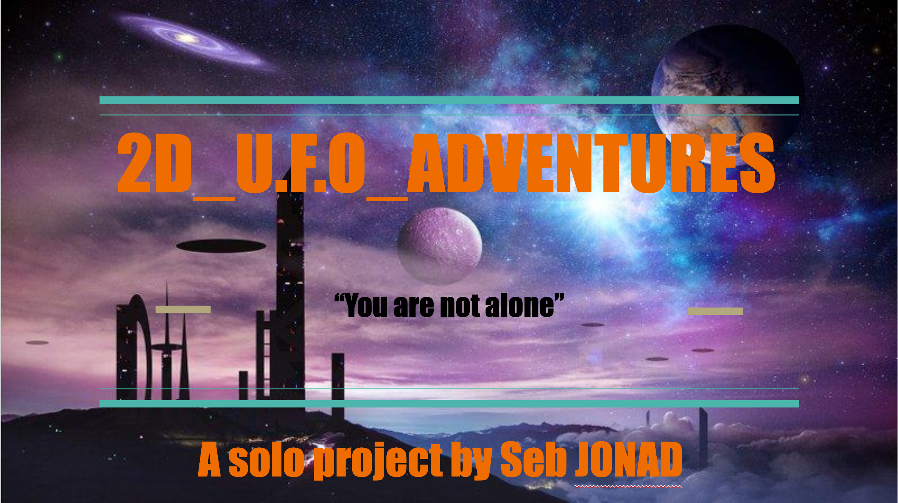
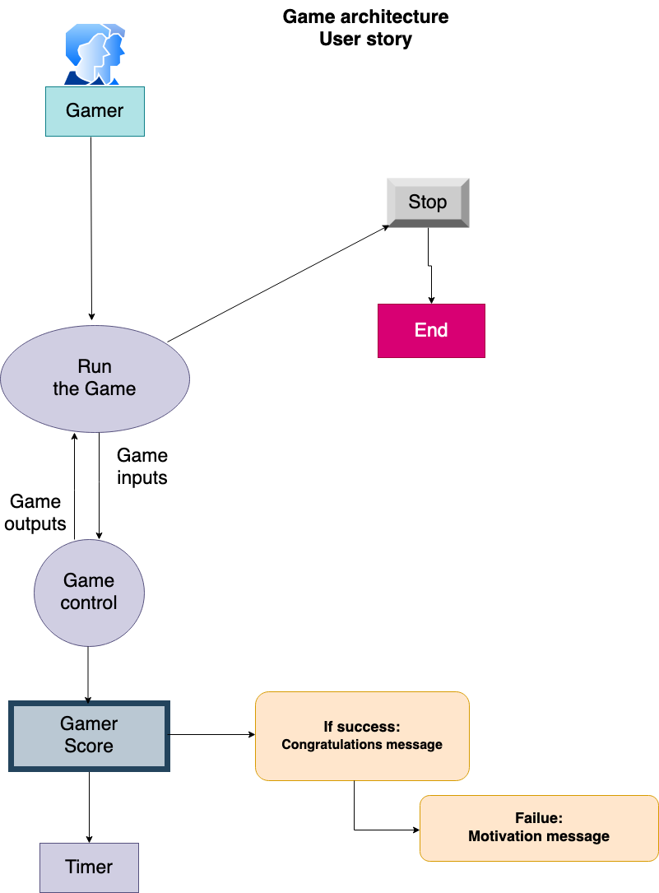

# 2D_U.F.O_ADVENTURES
Porfolio project

## INTRODUCTION
This project is a 2D GUI video game design with some of the main technology I have studied at Holberton School Laval.
This game will be especially designed to match the purpose of my Holberton school final portfolio project.
It will involve a main character, in an adventure quite simple and designed to show some of the knowledge I have learned in the context of [a space invader](https://en.wikipedia.org/wiki/Space_Invaders) like shooting game.

## THE GAME ARCHITECTURE

## TECHNOLOGIES & Software
- HTML
- CSS
- JavaScript 
- Blender
- Gimp
- Medibang
- Krita
- TexturePacker

I choose to use JavaScript instead of C and C#, because the coding syntax is shorter,  and I wanted to learn about this language. To do it in the context of this challenge with a short deadline is motivating. Even C is a low level and performing language faster, for my project this does not matter much.

For the animation I choose to use Javascript instead of unity because I will not have enough time to learn and experiment with this tool, and because this is a solo project nobody can help me in my task.
