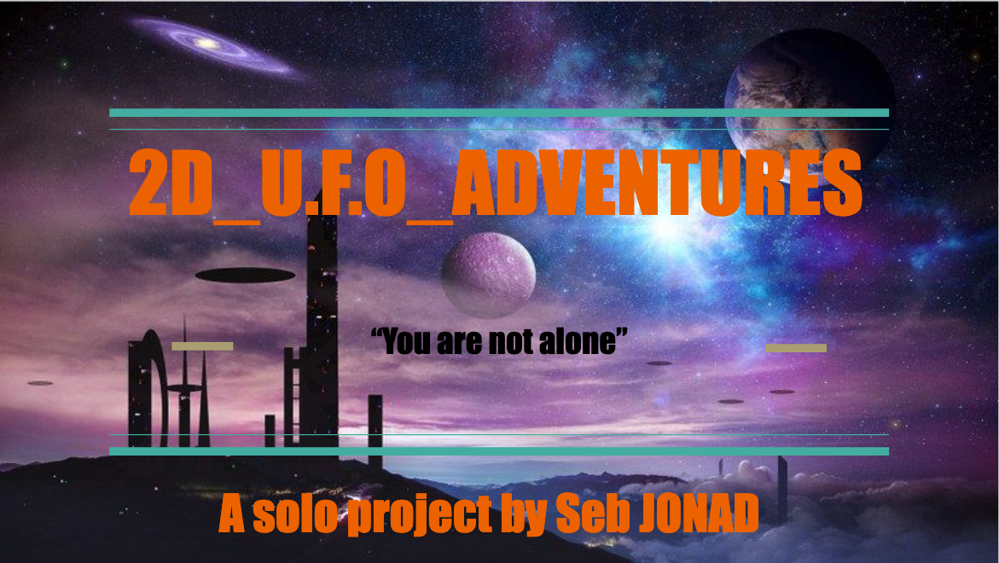

# 2D_U.F.O_ADVENTURES

Porfolio project

## INTRODUCTION

This project is a 2D GUI video game design with some of the main technology I have studied at Holberton School Laval.
This game will be especially designed to match the purpose of my Holberton school final portfolio project.
It will involve a main character, in an adventure quite simple and designed to show some of the knowledge I have learned in the context of [a space invader](https://en.wikipedia.org/wiki/Space_Invaders) like shooting game.

## THE GAME ARCHITECTURE

## TECHNOLOGIES & Software

- HTML
- CSS
- JavaScript
- Blender
- Gimp
- Medibang
- Krita
- TexturePacker

I choose to use JavaScript instead of C and C#, because the coding syntax is shorter,  and I wanted to learn about this language. To do it in the context of this challenge with a short deadline is motivating. Even C is a low level and performing language faster, for my project this does not matter much.

For the animation I choose to use Javascript instead of unity because I will not have enough time to learn and experiment with this tool, and because this is a solo project nobody can help me in my task.

## USAGE

There is no installation required.
You must have an active connection to internet. The browser’s API will run the game (available on Chrome, Firefox, and Brave).
To play the game use your keyboard, move the character using up and down arrows, and space bar to shoot.

## RULES

The player is a Spacecraft.

- Beat the clock Challenge game: You have 60 seconds to reach the max Score 500, else you lose.

- If there is a collision with the enemy -1 points.

- If there is a collision with an enemy you lose 1 point.

### Player motion

- Use “up” and “down” arrows to move the player, “space bare” to shoot.

- Collect the yellow fish to set the “Super mode”[ 2 lasers instead of 1 during 10 seconds]

## Links

- [Deployed site](https://chipper-peony-be8701.netlify.app/)

- [Landing page of the project]( https://jonseb974.github.io/2D_U.F.O_ADVENTURES/ )

- [Airbnb Clone project](https://github.com/jonseb974/holbertonschool-AirBnB_clone_v4)

## AUTHOR
- [Sebastien JONAD](https://github.com/jonseb974)
- [My linkedin](https://www.linkedin.com/mynetwork/)

